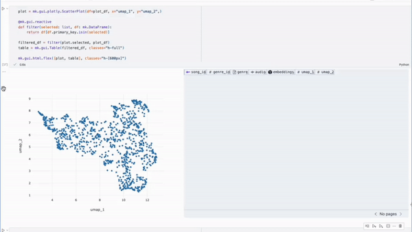

<div align="center">
    

---


[](https://img.shields.io/github/license/HazyResearch/meerkat)
[](https://github.com/pre-commit/pre-commit)

Create interactive views of any dataset.

[**Website**](http://meerkat.wiki)
| [**Quickstart**](http://meerkat.wiki/docs/start/quickstart-df.html)
| [**Docs**](http://meerkat.wiki/docs/index.html)
| [**Contributing**](CONTRIBUTING.md)
| [**Discord**](https://discord.gg/pw8E4Q26Tq)
| [**Blogpost**](https://hazyresearch.stanford.edu/blog/2023-03-01-meerkat)

</div>


## ⚡️ Quickstart

```bash
pip install meerkat-ml
```
<!-- 
> **_GPU Install_**: If you want to use Meerkat with a GPU, you will need to install PyTorch with GPU support. See [here](https://pytorch.org/get-started/locally/) for more details. -->

<!-- ```bash
pip install "meerkat-ml @ git+https://github.com/robustness-gym/meerkat@clever-dev"
```  -->
<!-- 
> **_Optional Dependencies_**: some parts of Meerkat rely on optional dependencies e.g. audio processing may rely on utilities from `torchaudio`. See  -->
<!-- 
Then try one of our demos,

```bash
mk demo tutorial-image-gallery --copy
```

Explore the code for this demo in `tutorial-image-gallery.py`. To see a full list of demos, use `mk demo --help`.  -->

**Next Steps**.
Check out our [Getting Started page](http://meerkat.wiki/docs/start/quickstart-df.html) and our [documentation](http://meerkat.wiki/docs/index.html) to start building with Meerkat.

## Why Meerkat?

Meerkat is an open-source Python library that helps users visualize, explore, and annotate any dataset. It is especially useful when processing unstructured data types (_e.g._ free text, PDFs, images, video) with machine learning models. 

### ✏️ Features and Design Principles

Here are four principles that inform Meerkat's design.

**(1) Low overhead.**  With four lines of Python, start interacting with any dataset. 
- Zero-copy integrations with your preferred data abstractions: Pandas, Arrow, HF Datasets, Ibis, SQL.
- Limited data movement. With Meerkat, you interact with your data where it already lives: no uploads to external databases and no reformatting.

```python
import meerkat as mk
df = mk.from_csv("paintings.csv")
df["image"] = mk.files("image_url")
df
```

<div align="center">
  
</div>


**(2) Diverse data types.** Visualize and annotate almost any data type in Meerkat interfaces: text, images, audio, video, MRI scans, PDFs, HTML, JSON. 

<div align="center">
	
</div>


**(3) "Intelligent" user interfaces.** Meerkat makes it easy to embed **machine learning models** (e.g. LLMs) within user interfaces to enable intelligent functionality such as searching, grouping and autocomplete. 

```python
df["embedding"] = mk.embed(df["img"], engine="clip")
match = mk.gui.Match(df,
	against="embedding",
	engine="clip"
)
sorted_df = mk.sort(df,
	by=match.criterion.name,
	ascending=False
)
gallery = mk.gui.Gallery(sorted_df)
mk.gui.html.div([match, gallery])
```

<div align="center">
	
</div>

**(4) Declarative (think: Seaborn), but also infinitely customizable and composable.**
Meerkat visualization components can be composed and customized to create new interfaces. 

```python
plot = mk.gui.plotly.ScatterPlot(df=plot_df, x="umap_1", y="umap_2",)

@mk.gui.reactive
def filter(selected: list, df: mk.DataFrame):
    return df[df.primary_key.isin(selected)]

filtered_df = filter(plot.selected, plot_df)
table = mk.gui.Table(filtered_df, classes="h-full")

mk.gui.html.flex([plot, table], classes="h-[600px]") 
```

<div align="center">
	
</div>


### ✨ Use cases where Meerkat shines
- _Exploratory analysis over unstructured data types._ [Demo](https://www.youtube.com/watch?v=a8FBT33QACQ)
- _Spot-checking the behavior of large language models (e.g. GPT-3)._  [Demo](https://www.youtube.com/watch?v=3ItA70qoe-o)
- _Identifying systematic errors made by machine learning models._ [Demo](https://youtu.be/4Kk_LZbNWNs)
- _Rapid labeling of validation data._

### 🤔 Use cases where Meerkat may not be the right fit

- _Are you only working with structured data (e.g. numerical and categorical variables)?_ Popular data visualization libraries (_e.g._ [Seaborn](https://seaborn.pydata.org/), [Matplotlib](https://matplotlib.org/)) are often sufficient. If you're looking for interactivity, [Plotly](https://plotly.com/) and [Streamlit](https://streamlit.io/) work well with structured data. Meerkat is differentiated in how it visualizes unstructured data types: long-form text, PDFs, HTML, images, video, audio...  
- _Are you trying to make a straightforward demo of a machine learning model (single input/output, chatbot) and share with the world?_ [Gradio](https://gradio.app/) is likely a better fit! Though, if your demo involves visualizing lots of data, you may find Meerkat useful.
- _Are you trying to manually label tens of thousands of data points?_  If you are looking for a data labeling tool to use with a labeling team, there are great open source labeling solutions designed for this (_e.g._ [LabelStudio](https://labelstud.io/)). In contrast, Meerkat is great fit for teams/individuals without access to a large labeling workforce who are using pretrained models (_e.g._ GPT-3) and need to label validation data or in-context examples.


<!-- Our goal is to make foundation models a more reliable
software abstraction for processing unstructured datasets.
[Read our blogpost to learn more.](https://hazyresearch.stanford.edu/blog/2023-03-01-meerkat)
 -->


## ✉️ About

Meerkat is being built by Machine Learning PhD students in the [Hazy Research](https://hazyresearch.stanford.edu) lab at Stanford. We're excited to build for a future where models will make it easier for teams to sift and reason through large volumes of unstructtured data effortlessly. 

Please reach out to `kgoel [at] cs [dot] stanford [dot] edu, eyuboglu [at] stanford [dot] edu, and arjundd [at] stanford [dot] edu` if you would like to use Meerkat for a project, at your company or if you have any questions.
