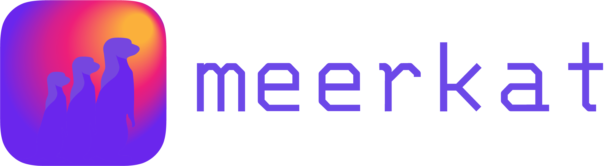

<div align="center">
    

---


[](https://img.shields.io/github/license/HazyResearch/meerkat)
[](https://github.com/pre-commit/pre-commit)

Meerkat is a open-source Python library designed for technical teams that want to interactively wrangle their unstructured data with foundation models.

[**Website**](http://meerkat.wiki)
| [**Quickstart**](http://meerkat.wiki/docs/start/quickstart-df.html)
| [**Docs**](http://meerkat.wiki/docs/index.html)
| [**Contributing**](CONTRIBUTING.md)
| [**Discord**](https://discord.gg/pw8E4Q26Tq)
| [**Blogpost**](https://hazyresearch.stanford.edu/blog/2023-03-01-meerkat)

</div>

## ⚡️ Quickstart

We recommend installing Meerkat in a virtual environment,

```bash
pip install meerkat-ml
```

> **_GPU Install_**: If you want to use Meerkat with a GPU, you will need to install PyTorch with GPU support. See [here](https://pytorch.org/get-started/locally/) for more details.

<!-- ```bash
pip install "meerkat-ml @ git+https://github.com/robustness-gym/meerkat@clever-dev"
```  -->

> **_Optional Dependencies_**: some parts of Meerkat rely on optional dependencies e.g. audio processing may rely on utilities from `torchaudio`. We leave it up to you to install necessary dependencies when required. As a convenience, we provide bundles of optional dependencies that you can install e.g. `pip install meerkat-ml[text]` for text dependencies. See `setup.py` for a full list of optional dependencies.

Then try one of our demos,

```bash
mk demo match
```

To see a full list of demos, use `mk demo --help`. (If this didn't work for you, we'd appreciate if you could open an issue and let us know.)

**Next Steps**.
Check out our [Getting Started page](https://meerkat.readthedocs.io/en/dev/guide/guide.html) and our [documentation](https://meerkat.readthedocs.io/en/dev/guide/guide.html) to start building with Meerkat. As we work to make the documentation more comprehensive, please feel free to open an issue or reach out if you have any questions.

## Why Meerkat?

Meerkat is an open-source Python library, designed to help
technical teams interactively wrangle images, videos, text
documents and more with foundation models.

Our goal is to make foundation models a more reliable
software abstraction for processing unstructured datasets.
[Read our blogpost to learn more.](https://hazyresearch.stanford.edu/blog/2023-03-01-meerkat)


Meerkat’s approach is based on two pillars:

**(1) Heterogeneous data frames with extended API.** At the heart of Meerkat is a data frame that can store structured fields (e.g. numbers, strings, and dates) alongside complex objects (e.g. images, web pages, audio) and their tensor representations (e.g. embeddings, logits) in a single table. Meerkat's data frame API goes beyond structured data analysis libraries like Pandas by providing a set of FM-backed unstructured data operations.

```python
import meerkat as mk

df = mk.from_csv("paintings.csv")
df["img"] = mk.files("img_path")
df["embeddings"] = mk.embed(df["img"], encoder="clip")
df
```

<div align="center">


</div>

**(2) Interactivity in Python.** Meerkat provides interactive data frame visualizations that allow you to control foundation models as they process your data.
Meerkat visualizations are implemented in Python, so they can be composed and customized in notebooks or data scripts.
Labeling is critical for instructing and validating foundation models. Labeling GUIs are a priority in Meerkat.

```python
match = mk.gui.Match(df,
	against="embedding",
	engine="clip"
)
sorted_df = mk.sort(df,
	by=match.criterion.name,
	ascending=False
)
gallery = mk.gui.Gallery(sorted_df)
mk.gui.html.div([match, gallery])
```

<div align="center">

</div>

## ✉️ About

Meerkat is being built by Machine Learning PhD students in the [Hazy Research](https://hazyresearch.stanford.edu) lab at Stanford. We're excited to build for a future where models will make it easier for teams to sift and reason through large volumes of data effortlessly. We have varied research backgrounds and have done research that touches all parts of the machine learning process: we've created new model architectures, studied model robustness and evaluation, worked on applications ranging from audio generation to medical imaging.

Please reach out to `kgoel [at] cs [dot] stanford [dot] edu, eyuboglu [at] stanford [dot] edu, and arjundd [at] stanford [dot] edu` if you would like to use Meerkat for a project, at your company or if you have any questions.
